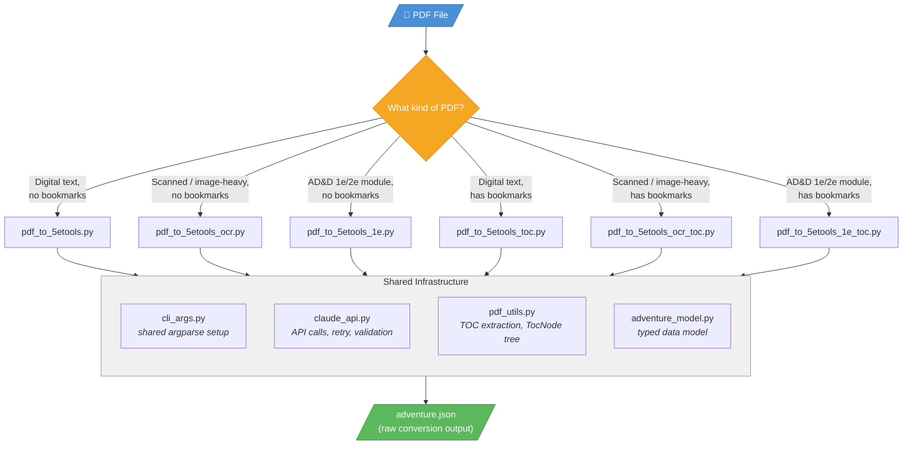
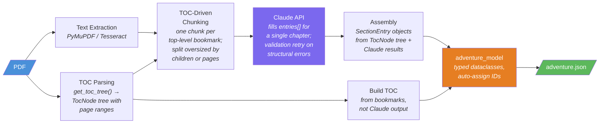
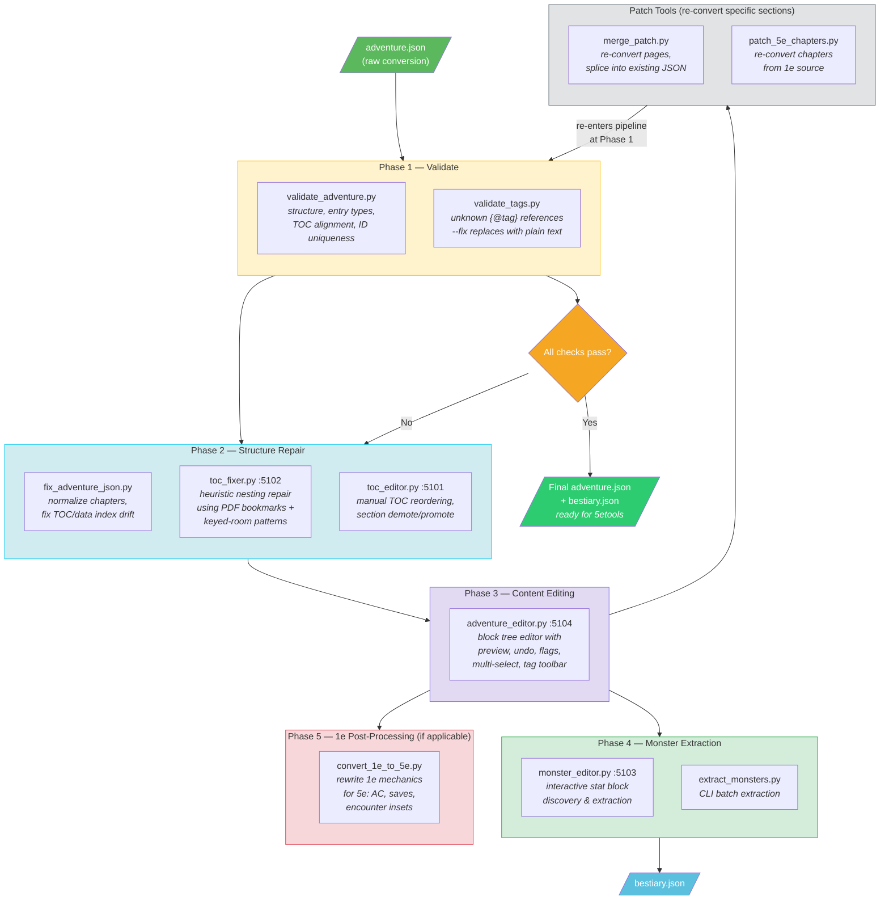
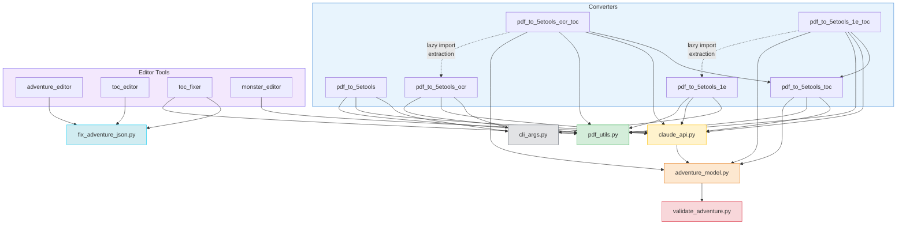
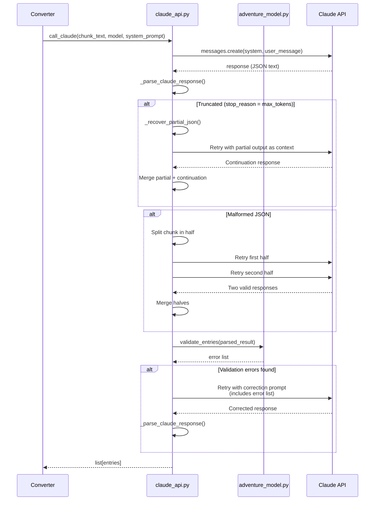
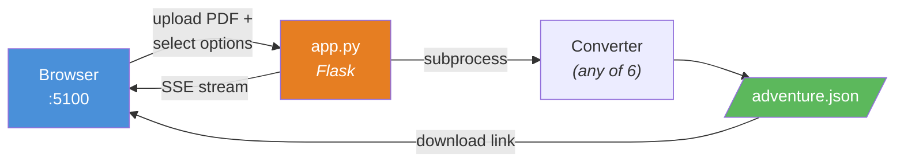

# PDF-to-5etools Pipeline Architecture

## Overview

This pipeline converts tabletop RPG PDFs into [5etools](https://5e.tools) homebrew JSON format, then provides a suite of tools to validate, repair, and refine the output.

## Core Conversion Pipeline

## Original Converter Internals (page-count chunking)

```mermaid
flowchart LR
    PDF[/"PDF"/] --> extract["Text Extraction<br/><i>PyMuPDF / Tesseract</i>"]
    extract --> headers["Running-Header<br/>Detection<br/><i>remove repeating<br/>headers/footers</i>"]
    headers --> annotate["Annotation<br/><i>[H1] [H2] [H3]<br/>[italic] [bold]<br/>[TABLE] [INSET]</i>"]
    annotate --> chunk["Page-Count<br/>Chunking<br/><i>6 / 4 / 3 pages<br/>per chunk</i>"]
    chunk --> toc_hint["TOC Hint<br/>Injection<br/><i>prepend bookmarks<br/>to each chunk</i>"]
    toc_hint --> claude["Claude API<br/><i>JSON array of<br/>5etools entries</i>"]
    claude --> post["Post-Processing<br/><i>merge chunks,<br/>hoist stray entries,<br/>assign IDs, build TOC</i>"]
    post --> JSON[/"adventure.json"/]

    style PDF fill:#4a90d9,color:#fff
    style JSON fill:#5cb85c,color:#fff
    style claude fill:#7b68ee,color:#fff
```

## TOC-Driven Converter Internals (bookmark chunking)

## Validation & Refinement Workflow

After conversion, the output is validated and iteratively refined using specialized tools. The typical workflow moves left-to-right, but any tool can be re-run at any point.

## Shared Module Dependencies

## Claude API Call Flow

## Web UI (app.py)

## Quick Reference: Which Tool When

| Symptom | Tool | Command |
|---------|------|---------|
| Unknown `{@tag}` errors / blank pages | `validate_tags.py --fix` | `python3 validate_tags.py adventure.json --fix` |
| TOC sidebar navigation broken | `fix_adventure_json.py` | `python3 fix_adventure_json.py adventure.json` |
| Sections nested wrong (flat/too deep) | `toc_fixer.py` + PDF | `python3 toc_fixer.py adventure.json --pdf source.pdf` |
| TOC order wrong | `toc_editor.py` | `python3 toc_editor.py adventure.json` |
| Content errors (text, formatting) | `adventure_editor.py` | `python3 adventure_editor.py adventure.json` |
| Missing/bad pages in output | `merge_patch.py` | `python3 merge_patch.py adventure.json patch.json --at N` |
| Need bestiary file for stat blocks | `monster_editor.py` | `python3 monster_editor.py adventure.json` |
| 1e stats need 5e conversion | `convert_1e_to_5e.py` | `python3 convert_1e_to_5e.py input.json output.json` |
| Full structural audit | `validate_adventure.py` | `python3 validate_adventure.py adventure.json` |
