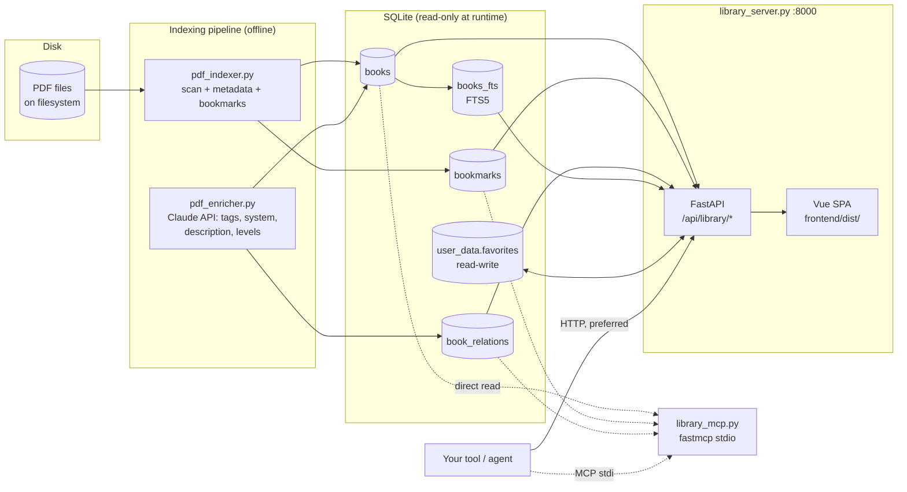

# RPG Library — Architecture & Integration Spec

This document is the contract for building tools on top of the RPG Library. The
**HTTP API** is the preferred integration surface; the MCP server is a thin
wrapper for Claude clients. Read this instead of the source — every claim
points at a file and line range so you can verify when needed.

## 1. System at a glance



**Integration rule of thumb:** if your tool is a process that can make HTTP
requests, use the REST API. The MCP server exists for Claude Desktop / Claude
Code and reads the DB directly — it does not go through the HTTP layer.

## 2. Process model

| Component | Entry point | How to run | Notes |
|---|---|---|---|
| API + SPA | `library_server.py:62` | `./service.sh start` | **Always** use `service.sh`; never spawn `python` directly. Default port 8000. |
| Indexer | `pdf_indexer.py` | `./index_rpgs.sh <path> <db> <source>` | Writes `books`, `bookmarks`. Reads filesystem. |
| Enricher | `pdf_enricher.py` | `./enrich_rpgs.sh <db>` | Writes `tags`, `description`, `game_system`, etc. via Claude API. |
| MCP server | `library_mcp.py:278` | `python library_mcp.py --db <db>` | stdio transport for Claude clients. |

DB paths are wired in `library_server.py:73-76`: the main DB is opened
**read-only** (`?mode=ro` in `library_api/db.py:27`); a sibling `user_data.db`
is opened read-write and ATTACHed as `user_data` for favorites.

## 3. The HTTP API

All endpoints are mounted under `/api/library` (router defined at
`library_api/routes.py:17`). CORS is wide open (`library_server.py:23-28`) so
browser tools, Obsidian, and local agents can call directly.

### 3.1 Endpoint reference

| Method | Path | Source | Returns |
|---|---|---|---|
| GET | `/api/library/search` | `routes.py:36` | `SearchResponse` |
| GET | `/api/library/search/facets` | `routes.py:78` | `FacetsResponse` |
| GET | `/api/library/books?ids=1,2,3` | `routes.py:117` | `list[BookSummary]` |
| GET | `/api/library/book/{id}` | `routes.py:131` | `BookDetail` |
| GET | `/api/library/book/{id}/text` | `routes.py:143` | `BookText` |
| GET | `/api/library/book/{id}/related?limit=N` | `routes.py:278` | `list[BookSummary]` |
| POST | `/api/library/book/{id}/favorite` | `routes.py:157` | `{is_favorite: true}` |
| DELETE | `/api/library/book/{id}/favorite` | `routes.py:168` | `{is_favorite: false}` |
| POST | `/api/library/book/{id}/open` | `routes.py:201` | Launches PDF in OS app |
| GET | `/api/library/book/{id}/pdf` | `routes.py:302` | Streams PDF (`inline`) |
| GET | `/api/library/filters` | `routes.py:181` | `FilterOptions` |
| GET | `/api/library/stats` | `routes.py:190` | `StatsResponse` |
| GET | `/api/library/topic/{type}/{name}` | `routes.py:261` | `TopicResponse` |
| GET | `/api/library/graph?min_score=&limit=&game_system=` | `routes.py:288` | `GraphResponse` |
| POST | `/api/library/nlq` | `routes.py:240` | `NlqResponse` |

All response shapes are Pydantic models in `library_api/models.py`. FastAPI
auto-generates an OpenAPI schema at `GET /openapi.json` and Swagger UI at
`GET /docs` — use these as the live source of truth.

### 3.2 What is and is not in a book record

`BookSummary` (`models.py:6-24`) — returned by all list endpoints:

- **Always present (subject to nullability):** `id`, `display_title`,
  `filename`, `publisher`, `collection`, `game_system`, `product_type`, `tags`,
  `series`, `source`, `page_count`, `has_bookmarks`, `description`,
  `min_level`, `max_level`, `is_favorite`, `variant_count`, `variant_ids`.
- **`tags`** is `list[str] | None` — already JSON-decoded from the DB column
  (`db.py:35-42`). Tags are exact snake_case strings from a fixed canonical
  vocabulary; see vocabulary list below.
- **`variant_count` / `variant_ids`** are populated only when the search was
  `grouped=true` (the default). For a single-variant book both are `1` and
  `[id]`. Expand a group via `GET /books?ids=...`.
- **`description`** is the LLM-generated description from enrichment; it is
  **not** truncated by the API — full text is returned. (The MCP `_summarise`
  helper truncates to 300 chars at `library_mcp.py:270`, but the HTTP API does
  not.)
- **`min_level` / `max_level`** are populated only for adventures and only
  where the enricher could extract a range. Many books have `null` for both.

`BookDetail` (`models.py:33-46`) — returned by `GET /book/{id}` only. Adds:

- `filepath` (absolute path on the indexer host), `relative_path`,
- raw PDF metadata: `pdf_title`, `pdf_author`, `pdf_creator`,
- `first_page_text` — the extracted first-page text (used by enrichment),
- `is_old_version`, `version_generation`,
- `product_id`, `product_version`,
- `date_indexed`, `date_enriched` (ISO strings),
- `bookmarks: list[Bookmark]` — full TOC tree as `(level, title, page_number)`,
  ordered by `id` which preserves indexer insertion order (`db.py:418-421`).

**What is NOT returned by any endpoint:**

- **Full PDF text content.** Only `first_page_text` is stored
  (`db.py:472-492`). To get full text, you must process the PDF yourself —
  either fetch via `GET /book/{id}/pdf` (which streams the file) or use
  `BookDetail.filepath` directly if you are on the same host.
- **Per-page text** beyond page 1.
- **Bookmark page text** — only `level/title/page_number` from the PDF
  outline.
- **Cover images / thumbnails.**
- **Embeddings or vectors.** Relatedness is tag-overlap +
  series-boost, not vector search (`db.py:718-795`).
- **Anything from `pdf_enricher.py`'s intermediate outputs** — only the final
  enriched columns end up in `books`.

### 3.3 Search — `GET /api/library/search`

Implemented at `routes.py:36-75` → `db.search_books` (`db.py:171-292`).

**Query params** (all optional unless noted):

- `q` — substring match (LIKE) across `display_title`, `filename`,
  `pdf_title`, `publisher`, `collection`, `series`, `description`, `tags`
  (`db.py:113-120`). **Not** FTS — case-insensitive substring only.
- `q_name` — same kind of LIKE, but only across title-ish fields
  (`db.py:121-126`).
- `game_system`, `product_type`, `publisher`, `series`, `source` — **exact
  equality**. Discover valid values via `/filters`. Case matters.
- `tags` — comma-separated; each tag is matched as a substring inside the JSON
  array column (`db.py:143-148`). All listed tags must be present (AND).
- `exclude_tags` — comma-separated; AND-of-NOTs.
- `char_level` — integer 1–30. Returns books whose `[min_level, max_level]`
  range covers this level (`db.py:155-163`). Books with NULL levels are
  excluded.
- `sort` — one of: `title`, `filename`, `publisher`, `game_system`,
  `product_type`, `series`, `source`, `page_count`, `collection`
  (`db.py:66-69`). Anything else is silently ignored (default: title).
- `sort_dir` — `asc` (default) or `desc`.
- `include_old`, `include_drafts`, `include_duplicates` — default `false`. The
  three `is_*` flags filter out by default (`db.py:106-111`).
- `favorites_only` — requires the user-data DB; otherwise returns nothing.
- `grouped` — default `true`. **Important behavior:**
  - When grouped, results are deduplicated by
    `(publisher_lc, normalized_collection)` (`db.py:72-80`). One representative
    book is returned per group; `variant_count` and `variant_ids` describe the
    group. `total` is the **group count**, not the book count.
  - When `grouped=false`, you get raw rows, `total` is the book count, and
    `variant_count`/`variant_ids` are not meaningful.
- `page` (1-based), `per_page` (default 50, max 500).

**Response — `SearchResponse`** (`models.py:49-54`):
```json
{
  "results": [BookSummary, ...],
  "total": 1234,
  "page": 1,
  "per_page": 50,
  "total_pages": 25
}
```

**Build a result-list URL like the UI does:**
```
GET /api/library/search?q=ravenloft&game_system=D%26D%205e&tags=horror,undead&char_level=5
```

### 3.4 Search facets — `GET /api/library/search/facets`

`routes.py:78-114` → `db.search_facets` (`db.py:295-384`). Same query params as
`/search` minus pagination/sort/grouping. Returns aggregations of the matching
set:

```json
{
  "total": 87,
  "series":      [{"value": "Ravenloft",    "count": 8}, ...],
  "publisher":   [{"value": "WotC",         "count": 24}, ...],
  "game_system": [{"value": "D&D 5e",       "count": 87}, ...],
  "tag":         [{"value": "horror",       "count": 14}, ...]
}
```

Each list is sorted by descending count; empty/NULL values are dropped. Use
this to render "drill into matching set by X" UIs without re-querying.

### 3.5 Natural-language query — `POST /api/library/nlq`

`routes.py:240-258` → `library_api/nlq.py`.

Pipeline:
1. Caller posts `{"query": "high level horror adventure for 5e"}`.
2. `parse_query` (`nlq.py:64-105`) calls **Claude Haiku 4.5**
   (`claude-haiku-4-5-20251001`, `nlq.py:18`) with the system prompt at
   `nlq.py:20-46` and parses the JSON.
3. Output is `{game_system, product_type, tags[], keywords, level_min,
   level_max}`.
4. `db.nlq_search` (`db.py:527-604`) runs an FTS5 MATCH on `books_fts` joined
   to `books`, AND-combined with structured filters; falls back to LIKE on
   `display_title`/`description`/`tags` if FTS5 is unavailable.

**Response — `NlqResponse`** (`models.py:106-109`):
```json
{
  "query_parsed": {"game_system": "D&D 5e", "product_type": "adventure",
                   "tags": ["horror"], "keywords": "high level horror",
                   "level_min": null, "level_max": null},
  "results": [BookSummary, ...],
  "total": 12
}
```

**Limitations to design around:**
- `game_system` and `product_type` must come from the hardcoded vocab in the
  Haiku prompt (`nlq.py:22-24`). Anything else becomes `null`.
- Tags must match the canonical snake_case list at `nlq.py:26`. Off-vocab
  concepts get dropped.
- Keywords are sanitized: non-alphanumeric stripped, max 12 words
  (`nlq.py:58-61`).
- Hard limit of 30 results (`db.py:535`); no pagination.
- Any error during Haiku parse → keyword-only fallback (`nlq.py:96-105`); no
  exception is propagated.

### 3.6 Topic hub — `GET /api/library/topic/{topic_type}/{topic_name}`

`routes.py:261-274` → `db.get_topic` (`db.py:666-694`).

`topic_type` ∈ `{game_system, tag, series, publisher}` (validated at
`routes.py:264-266`; 400 otherwise). `topic_name` is the exact value (case
matters). 404 if no books match.

Response — `TopicResponse` (`models.py:122-126`):
```json
{
  "topic_type": "tag",
  "topic_name": "horror",
  "stats": {
    "total": 47, "enriched": 47,
    "by_product_type":   [{"value": "adventure", "count": 30}, ...],
    "top_publishers":    [{"value": "WotC",      "count": 12}, ...],
    "top_tags":          [],   // empty when topic_type == "tag"
    "top_series":        [...],
    "top_game_systems":  [...]
  },
  "books": [BookSummary, ...]
}
```

The breakdown for the topic's own dimension is intentionally empty (see
`db.py:659-662`). All non-superseded, non-draft, non-duplicate books are
included; there is no pagination.

### 3.7 Related books — `GET /api/library/book/{id}/related`

`routes.py:278-285` → `db.get_related_books` (`db.py:718-795`).

- Primary path: reads the precomputed `book_relations` table ordered by
  `score DESC`.
- Fallback: tag-overlap counting + a +10 boost for same-series books
  (`db.py:758-777`). No vector embeddings are used anywhere.
- `limit` default 6, max 20.

If `book_relations` is empty (no relationship pass run), the fallback still
returns useful results provided the book has tags.

### 3.8 Graph — `GET /api/library/graph`

`routes.py:288-299` → `db.get_graph` (`db.py:798-867`). Designed for D3 force
layouts.

Params:
- `min_score` ∈ [0, 1], default 0.25.
- `limit` — caps the **node** count (default 300, max 1000). Edges are
  filtered to those between included nodes.
- `game_system` — optional; restricts both endpoints of every edge.

Response — `GraphResponse` (`models.py:141-143`):
```json
{
  "nodes": [{"id": 17, "label": "Curse of Strahd", "group": "D&D 5e"}, ...],
  "edges": [{"source": 17, "target": 42, "score": 0.71}, ...]
}
```

Empty arrays if no edges meet the threshold.

### 3.9 Filters & stats

`GET /filters` (`routes.py:181`, `db.py:495-524`) returns a `FilterOptions`
with all distinct values + counts for `game_system`, `product_type`,
`publisher`, `series`, `source`, plus tag frequencies decoded from the JSON
column. **Use this to discover valid filter values before issuing exact-match
searches.** Old versions are excluded from these counts.

`GET /stats` (`routes.py:190`, `db.py:870-901`) returns `total_books`,
`enriched_books`, `books_with_bookmarks`, plus `by_source` and
`by_product_type` breakdowns.

### 3.10 PDF access

- `POST /book/{id}/open` (`routes.py:201-235`) — server-side launches the file
  in the host's PDF app. WSL → `explorer.exe` with `wslpath -w` conversion.
  Linux → `xdg-open`. macOS → `open`. Returns `{status, filepath}` or 500 on
  spawn failure. **Only useful when the API client is the same person sitting
  at the indexer host.** Don't use this from a remote tool.
- `GET /book/{id}/pdf` (`routes.py:302-321`) — streams the file with
  `Content-Disposition: inline`. Use this for browser preview or remote
  fetching.
- 404 if the file moved on disk after indexing.

### 3.11 Favorites

Two endpoints toggle a row in the read-write `user_data.favorites` table:

- `POST /book/{id}/favorite` → `{is_favorite: true}`
- `DELETE /book/{id}/favorite` → `{is_favorite: false}`

Implemented at `db.py:444-459`. Every book record returned by the API includes
`is_favorite` (joined from `user_data.favorites` — `db.py:245-247`).

## 4. The MCP server

`library_mcp.py` exposes a subset of the same DB queries as MCP tools for
Claude clients. It does **not** call the HTTP API; it imports `library_api.db`
directly (`library_mcp.py:30`).

| MCP tool | Source | Notes |
|---|---|---|
| `search_books` | `library_mcp.py:47` | Always `grouped=False`. Adds a `tier` arg (1–4) that maps to a level range (`library_mcp.py:38`). `per_page` capped at 100. |
| `get_book` | `library_mcp.py:124` | Same as `GET /book/{id}` but tags/bookmarks JSON-parsed defensively. |
| `get_topic` | `library_mcp.py:154` | Wraps `db.get_topic`; books summarized via `_summarise` (description truncated to 300 chars at `library_mcp.py:270`). |
| `get_related_books` | `library_mcp.py:180` | Default `limit=8`, max 20. |
| `list_filters` | `library_mcp.py:197` | Same as `GET /filters`. |
| `get_stats` | `library_mcp.py:211` | Same as `GET /stats`. |
| `find_books_by_tag` | `library_mcp.py:223` | Convenience around `search_books(tags=...)`. |

The MCP server has **no** `nlq`, `facets`, `graph`, `pdf` streaming, or
favorites tools. If you need those, use HTTP.

## 5. Canonical vocabulary

All exact-match filter values are derived from enrichment. The Haiku NLQ
prompt at `library_api/nlq.py:20-46` is the authoritative list — copy from
there if you need to embed valid values in your tool.

- **Game systems:** `D&D 5e`, `Pathfinder 1e`, `Pathfinder 2e`, `OSR`,
  `Call of Cthulhu`, `Dungeon Crawl Classics`, `Year Zero Engine`,
  `System Neutral`, `Universal`, `D&D 3.5e`, `D&D 4e`, `AD&D`, `GURPS`,
  `Savage Worlds`, `FATE`, `Powered by the Apocalypse`, `Blades in the Dark`,
  `Mothership`, `Alien RPG`, `Vampire: the Masquerade`, `Cypher System`,
  `13th Age`, `Dragonbane`.
- **Product types** (lowercase, snake_case): `adventure`, `sourcebook`,
  `bestiary`, `magic_items`, `character_options`, `gm_aid`, `map_pack`,
  `character_sheet`, `setting`, `anthology`, `non_rpg`.
- **Tags:** see the long list at `nlq.py:26`. ~80 entries covering content
  themes, genres, edition shorthands, and named campaign settings.

If you need values outside this vocabulary, the enricher must be re-run with
an updated vocabulary; you can't add them at query time.

## 6. Data model (selected columns)

Confirmed via the queries in `db.py`. See `pdf_indexer.py` and
`pdf_enricher.py` for the writers.

`books`:
- Identity: `id`, `filename`, `filepath`, `relative_path`.
- PDF metadata (from indexer): `pdf_title`, `pdf_author`, `pdf_creator`,
  `page_count`, `first_page_text`, `has_bookmarks`.
- Enriched (from `pdf_enricher.py`): `display_title`, `description`,
  `game_system`, `product_type`, `publisher`, `collection`, `series`,
  `source`, `tags` (JSON string), `min_level`, `max_level`.
- Lifecycle flags: `is_old_version`, `is_draft`, `is_duplicate`,
  `version_generation`, `product_id`, `product_version`, `date_indexed`,
  `date_enriched`.

`bookmarks`: `book_id`, `level` (depth), `title`, `page_number`. Returned in
insertion order.

`book_relations`: `book_id_a`, `book_id_b`, `score` (0–1). Optional —
populated only after a relationship-detection pass; the API gracefully falls
back without it.

`books_fts`: FTS5 virtual table; `rowid` matches `books.id`. Used only by
`/nlq`.

`user_data.favorites` (separate DB, attached): `book_id`, `date_added`.
Created on demand by `db.init_user_db` (`db.py:8-18`).

## 7. Building tools on top — guidance

- **Discover before filtering.** Call `/filters` once at startup and cache it.
  This gives you exact-match values for `game_system`, `product_type`,
  `publisher`, `series`, `source`, plus the live tag vocabulary with counts.
- **Pagination & grouping.** For UIs that show "books," default to
  `grouped=true` (you'll see one entry per print run / collection). For
  pipelines that need every PDF, set `grouped=false`.
- **Free-text search choice.**
  - User-typed queries with mixed concepts → `POST /nlq` (handles "5e horror
    adventure for level 5").
  - Programmatic exact filters → `GET /search` with structured params.
  - Substring across titles/descriptions → `GET /search?q=...` (LIKE-based,
    no FTS).
- **Don't rely on `min_level`/`max_level` being populated.** Filter only when
  the user explicitly asks; otherwise show all matches.
- **Full text is not in the API.** If your tool needs to read inside a PDF,
  fetch `GET /book/{id}/pdf` and run your own extractor; do not assume the
  server has cached page text beyond page 1.
- **Stable identifiers.** `books.id` is the integer primary key — stable
  across re-enrichment runs but **not** across a re-index from scratch. If you
  persist references in your tool, also store `relative_path` or `product_id`
  as a recovery key.
- **Don't write to `books` directly.** The API opens it read-only. If you
  need to add data (e.g. your own annotations), create a sibling SQLite that
  ATTACHes the same way `user_data.db` does, or store outside.
- **Per-tool DB connections.** Every route in `routes.py` opens and closes a
  fresh connection per request (`_conn()` at `routes.py:30-31`). If you embed
  `library_api.db` directly, do the same — don't share connections across
  threads.
- **Live OpenAPI:** point your client generator at
  `http://localhost:8000/openapi.json` for typed bindings.

## 8. Quick recipes

**Find horror adventures for a 5th-level party (5e):**
```
GET /api/library/search
    ?game_system=D%26D%205e
    &product_type=adventure
    &tags=horror
    &char_level=5
    &grouped=true
```

**"What 5e horror is in my library?" (NLQ):**
```
POST /api/library/nlq
{ "query": "5e horror adventures for level 5" }
```

**Build a sidebar of facet counts under the current query:**
```
GET /api/library/search/facets?<same params as /search>
```

**Get full detail + TOC for one book:**
```
GET /api/library/book/42
```

**Stream the PDF for in-browser preview:**
```
<embed src="/api/library/book/42/pdf" type="application/pdf">
```

**Discover valid filter values:**
```
GET /api/library/filters
```
